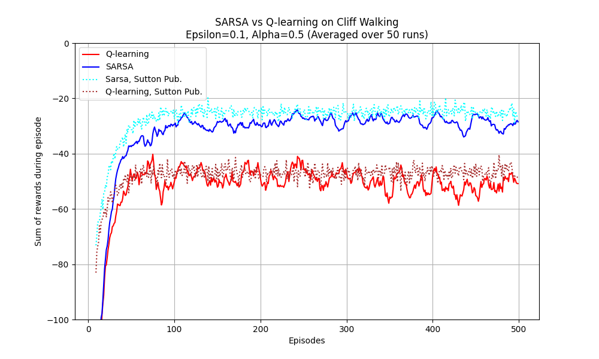
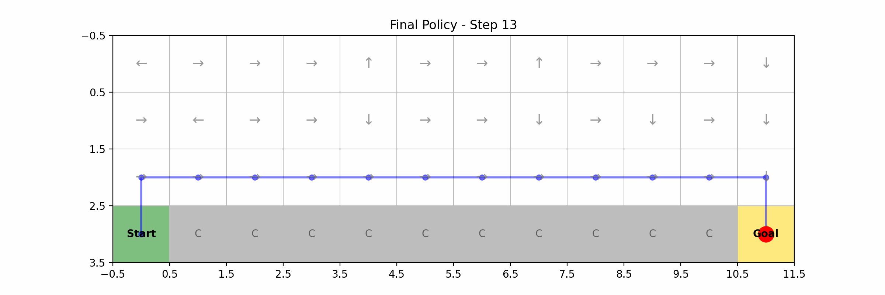
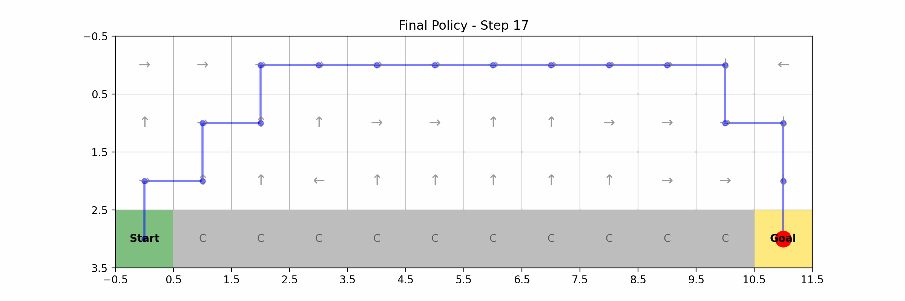
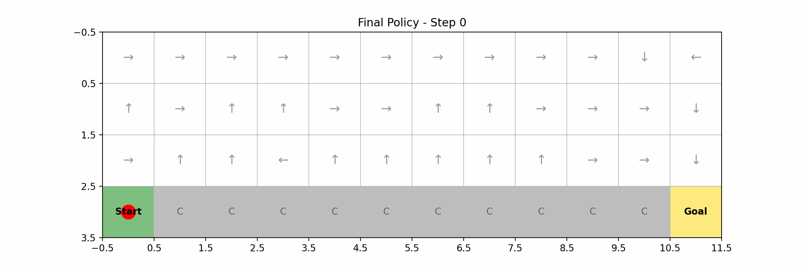

# Q-learning vs SARSA in Cliff Walking Environment

## Introduction
This project implements and compares two fundamental Reinforcement Learning algorithms: Q-learning (Off-policy) and SARSA (On-policy). The algorithms are evaluated using a classic Cliff Walking grid world environment. The primary objective is to demonstrate the behavioral differences between an aggressive, optimal-seeking approach and a conservative, risk-averse approach during the training phase.

## Features
- Custom Cliff Walking grid environment implementation.
- Core implementation of Q-learning and SARSA agents.
- Automated training pipelines with tracking of cumulative rewards.
- Visualization tools for rendering learning curves and final policy paths.
- Automated PDF report generation for result analysis.

## Project Structure
- `src/`: Contains source code including the environment, agents, training logic, and visualization scripts.
- `assets/`: Stores the generated plots, animations, and policy frames.
- `report/`: Contains the automated PDF generation script and the final output report.

## Analytical Results

### 1. Learning Performance Comparison


**Observation**: During the training phase, SARSA's cumulative reward rapidly increases and stabilizes at a higher baseline. Conversely, Q-learning's cumulative reward remains lower and exhibits severe fluctuations. 

**Explanation**: This phenomenon occurs because SARSA rapidly learns a safe detour to avoid the cliff. Q-learning, while searching for the absolute shortest path, frequently falls into the cliff due to epsilon-greedy exploration, leading to extreme penalties and high variance.

### 2. Learned Policy Behavior
**Q-learning Final Policy:**


**SARSA Final Policy:**


**Observation**: The visualization shows Q-learning selecting the shortest, most dangerous path directly adjacent to the cliff edge. SARSA, on the other hand, selects a longer, significantly safer path far from the cliff.

**Explanation**: This confirms the theoretical distinction between the two algorithms. Q-learning (Off-policy) assumes a purely greedy approach during value updates, leaning toward aggressive risk-taking to achieve the theoretically optimal path. SARSA (On-policy) integrates the ongoing exploration policy into its value updates, resulting in a conservative approach that prioritizes avoiding the massive penalties of the cliff.

### 3. Policy Animations
**Q-learning Path Execution:**


**SARSA Path Execution:**


## Installation
Ensure Python 3.9 or higher is installed on your system. To set up the environment and install dependencies, execute the following commands:

```bash
python3 -m venv venv
source venv/bin/activate
pip install numpy matplotlib pillow reportlab
```

## Usage Instructions

To execute the training process and generate comparative models:
```bash
source venv/bin/activate
python src/train.py
```

To visualize the training results and export analytical plots:
```bash
python src/visualize.py
```

To generate the analytical PDF report based on the training outcomes:
```bash
cd report
python generate_report.py
```

## Configuration
Model hyperparameters including learning rate (alpha), discount factor (gamma), exploration rate (epsilon), and the total number of training episodes can be configured directly within the execution block of `src/train.py`. The grid dimensions and environmental rewards can be modified in `src/cliff_walking.py`.

## License
This project is licensed under the MIT License. You are free to use, modify, and distribute the source code in accordance with the terms of the license.
